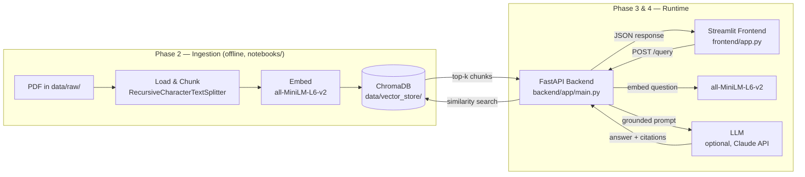

# RAG Document Assistant

A retrieval-augmented generation (RAG) system for asking grounded, cited questions over your own documents. Documents are chunked and embedded locally, stored in a persistent ChromaDB vector store, served through a FastAPI backend, and queried from a Streamlit chat interface.

---

## 1. Overview & Architecture

The system has three moving parts: an offline **ingestion notebook** that builds the vector store once, a **FastAPI backend** that loads that store and answers queries at runtime, and a **Streamlit frontend** that talks to the backend over HTTP.



**Request flow for a single question:**
1. User types a question in the Streamlit chat UI.
2. The frontend (`api_client.py`) POSTs `{"question": ..., "top_k": ...}` to `backend`'s `/query` endpoint.
3. The backend embeds the question with the same model used at ingestion time, runs a similarity search against the persisted ChromaDB collection, and retrieves the top-k chunks.
4. Those chunks are assembled into a grounded prompt and (optionally) sent to an LLM for generation; if no LLM key is configured, the top chunk is returned as a transparent fallback.
5. The backend returns `{"question", "answer", "sources"}`; the frontend renders the answer as markdown and the sources as citation cards.

---

## 2. Tech Stack & Project Structure

### Tech stack

| Layer | Technology |
|---|---|
| Frontend | Streamlit, `requests`, `python-dotenv` |
| Backend | FastAPI, Uvicorn, Pydantic / `pydantic-settings` |
| Embeddings | `sentence-transformers` — `all-MiniLM-L6-v2` (384-dim) |
| Vector store | ChromaDB (`PersistentClient`, local on-disk) |
| Chunking | LangChain `RecursiveCharacterTextSplitter` |
| Generation (optional) | Anthropic Claude API |
| Ingestion / evaluation | Jupyter Notebook, `pypdf`, `pandas` |

### Project structure

```
rag-assistant-project/
├── backend/
│   ├── app/
│   │   ├── main.py                  # FastAPI app, CORS, startup loading
│   │   ├── api/
│   │   │   └── routes/
│   │   │       └── query.py         # GET /health, POST /query
│   │   ├── core/
│   │   │   └── config.py            # Settings loaded from .env
│   │   ├── schemas/
│   │   │   └── query.py             # QueryRequest / QueryResponse / SourceChunk
│   │   └── services/
│   │       ├── retrieval.py         # Loads vector store, retrieves chunks
│   │       └── generation.py        # Calls LLM / returns context fallback
│   ├── requirements.txt
│   └── .env.example
├── frontend/
│   ├── app.py                       # Streamlit chat interface
│   ├── api_client.py                # HTTP client for the backend
│   ├── requirements.txt
│   ├── .env.example
│   └── .streamlit/
│       └── config.toml              # Native theme matching the custom CSS
├── data/
│   ├── raw/                         # Source PDFs (input to ingestion)
│   └── vector_store/                # Persistent ChromaDB collection (generated)
├── notebooks/
│   └── phase2_rag_pipeline.ipynb    # Ingestion, chunking, embedding, eval
└── README.md
```

### Vector store & schema reference

| Item | Value |
|---|---|
| Vector store path | `./data/vector_store` |
| Collection name | `document_assistant` |
| Embedding model | `sentence-transformers/all-MiniLM-L6-v2` |
| Embedding dimension | 384 |
| Distance metric | cosine |
| Chunk size / overlap | 800 chars / 120 chars |
| Stored metadata per chunk | `source` (file name), `page`, `chunk_index` |

`QueryRequest` / `QueryResponse` schemas (`backend/app/schemas/query.py`):

```python
class QueryRequest(BaseModel):
    question: str
    top_k: int = 4

class SourceChunk(BaseModel):
    source: str
    page: int
    chunk_index: int
    text: str
    distance: float

class QueryResponse(BaseModel):
    question: str
    answer: str
    sources: List[SourceChunk]
```

---

## 3. Domain & Data

> **Fill this section in for your specific submission** — it's written as a template since the actual source document(s) depend on your assignment.

This assistant answers questions grounded in the document(s) placed in `data/raw/`. Describe here:

- **Document type(s):** e.g. a single PDF report, a policy manual, a research paper
- **Domain:** e.g. legal, academic, internal company knowledge base
- **Size:** number of documents and total pages (see the "Load & Inspect" section of `notebooks/phase2_rag_pipeline.ipynb` for exact counts, generated automatically when the notebook runs)
- **Known limitations:** e.g. scanned/image-only pages that don't extract cleanly, tables that lose structure when flattened to plain text

The assistant will only answer from what's actually in `data/raw/` — if a question falls outside the ingested content, it responds that it doesn't have enough information rather than guessing.

---

## 4. Setup

### Prerequisites
- Python 3.10+
- (Optional) an Anthropic API key, for real LLM generation instead of the extractive fallback

### Backend setup

```bash
# From the project root
python3 -m venv venv
source venv/bin/activate        # Windows: venv\Scripts\activate

cd backend
pip install -r requirements.txt
cp .env.example .env            # edit if you need non-default values
uvicorn app.main:app --reload --port 8000
```

The backend will fail to start with a clear error if `data/vector_store/` doesn't exist yet — run the ingestion notebook first (see below) if you haven't already.

Verify it's up:
```bash
curl http://127.0.0.1:8000/health
```

### Running the ingestion notebook (if the vector store doesn't exist yet)

```bash
# In the same venv, from the project root
pip install jupyter
jupyter notebook notebooks/phase2_rag_pipeline.ipynb
```
Run all cells top to bottom. This populates `data/vector_store/` from whatever PDFs are in `data/raw/`.

### Frontend setup

Open a **second terminal**:

```bash
# From the project root
python3 -m venv venv             # skip if you're reusing the same venv as the backend
source venv/bin/activate         # Windows: venv\Scripts\activate

cd frontend
pip install -r requirements.txt
cp .env.example .env             # edit if your backend isn't on localhost:8000
streamlit run app.py
```

Streamlit will open at `http://localhost:8501`. Make sure the backend (step above) is already running — the sidebar's connection status indicator will show red if it isn't.

---

## 5. Environment Variables

### Backend (`backend/.env`)

| Variable | Default | Description |
|---|---|---|
| `VECTOR_STORE_PATH` | `./data/vector_store` | Path to the persisted ChromaDB store |
| `COLLECTION_NAME` | `document_assistant` | ChromaDB collection name |
| `EMBEDDING_MODEL_NAME` | `all-MiniLM-L6-v2` | Sentence-transformers model used for query embedding |
| `DEFAULT_TOP_K` | `4` | Default number of chunks retrieved per query |
| `MAX_TOP_K` | `20` | Upper bound accepted for `top_k` in requests |
| `ANTHROPIC_API_KEY` | *(unset)* | If set, enables real LLM generation; otherwise falls back to returning the top retrieved chunk |
| `GENERATION_MODEL` | `claude-sonnet-4-6` | Model used for generation when an API key is set |
| `GENERATION_MAX_TOKENS` | `500` | Max tokens for the generated answer |
| `CORS_ORIGINS` | `*` | Comma-separated allowed origins, or `*` for all |

### Frontend (`frontend/.env`)

| Variable | Default | Description |
|---|---|---|
| `API_BASE_URL` | `http://localhost:8000` | Base URL of the FastAPI backend |

---

## 6. API Reference

### `GET /health`

Readiness check — confirms the embedding model and vector store are loaded.

```bash
curl http://127.0.0.1:8000/health
```

```json
{
  "status": "ok",
  "collection": "document_assistant",
  "vector_store_path": "./data/vector_store",
  "chunks_loaded": 128,
  "embedding_model": "all-MiniLM-L6-v2"
}
```

### `POST /query`

Retrieves the top-k relevant chunks for a question and returns a grounded answer with cited sources.

**Request body:**
```json
{
  "question": "What is the main topic of this document?",
  "top_k": 4
}
```

**cURL example:**
```bash
curl -X POST http://127.0.0.1:8000/query \
  -H "Content-Type: application/json" \
  -d '{"question": "What is the main topic of this document?", "top_k": 4}'
```

**Response:**
```json
{
  "question": "What is the main topic of this document?",
  "answer": "The document primarily discusses ... [1]",
  "sources": [
    {
      "source": "example.pdf",
      "page": 2,
      "chunk_index": 0,
      "text": "...matching chunk text...",
      "distance": 0.184
    }
  ]
}
```

If `top_k` is omitted, the backend's `DEFAULT_TOP_K` is used. A `question` that yields no matches (e.g. an empty or freshly created collection) returns an empty `sources` list and an answer explaining there isn't enough information.

---

## 7. Evaluation (Phase 2.6)

The ingestion notebook (`notebooks/phase2_rag_pipeline.ipynb`, Evaluation section) runs a set of sample questions end-to-end through retrieval and generation, and lays out the results as a table for manual review. The table format looks like this:

| question | top_sources | num_chunks_retrieved | answer_preview |
|---|---|---|---|
| What is the main topic of this document? | *(populated on run)* | *(populated on run)* | *(populated on run)* |
| Summarize the key points in one paragraph. | *(populated on run)* | *(populated on run)* | *(populated on run)* |
| Does the document mention any dates or deadlines? | *(populated on run)* | *(populated on run)* | *(populated on run)* |

> **Note:** this table is generated fresh each time the notebook runs, against whatever's currently in `data/raw/` — replace the placeholders above with the actual output from your run (copy the `eval_df` table from the notebook) before submitting. If `ANTHROPIC_API_KEY` isn't set, `answer_preview` will show the extractive fallback rather than a generated answer, which is expected — it's a valid check of the retrieval half of the pipeline on its own.

**What to look for when reviewing:**
- `top_sources` should point to the correct document/page for each question — this is the main grounding sanity check.
- `num_chunks_retrieved` should equal the requested `top_k` unless the store has fewer chunks than that.
- `answer_preview` should stay on-topic and cite the retrieved snippets rather than introducing unsupported claims.

---

## 8. Screenshots

> Replace these placeholders with actual screenshots before submitting.

**Empty state / hero**
```

```

**Conversation with cited sources**
```

```

**Backend health check / API docs**
```

```

Suggested location for the actual image files: `docs/screenshots/`.
